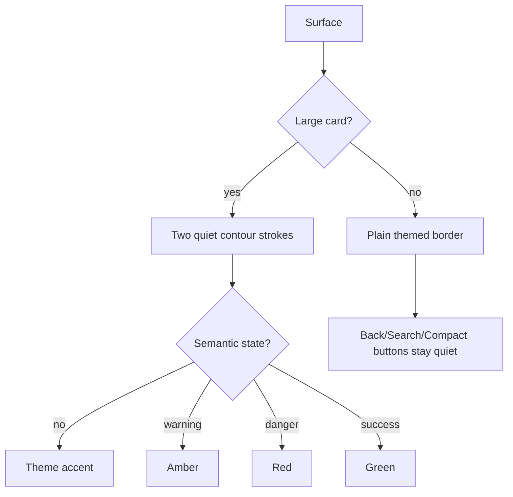

# v1.4.25 — Accent-card rules

Implementation rule used by legacy rounded-background helpers:

- `radiusDp >= 14` → large-card accent stroke;
- explicit semantic/accent controls still override this rule.
