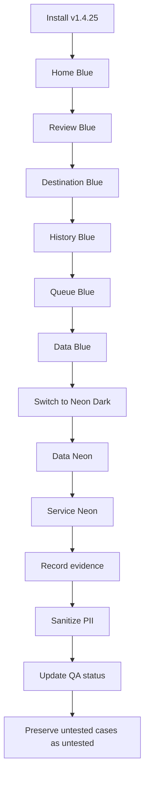

# v1.4.25 — Phone QA Flow

```mermaid
flowchart TD
    A[Install v1.4.25] --> B[Home Blue]
    B --> C[Review Blue]
    C --> D[Destination Blue]
    D --> E[History Blue]
    E --> F[Queue Blue]
    F --> G[Data Blue]
    G --> H[Switch to Neon Dark]
    H --> I[Data Neon]
    I --> J[Service Neon]
    J --> K[Record evidence]
    K --> L[Sanitize PII]
    L --> M[Update QA status]
    M --> N[Preserve untested cases as untested]
```

The flow deliberately separates **visual proof** from **functional write/search regression**.
