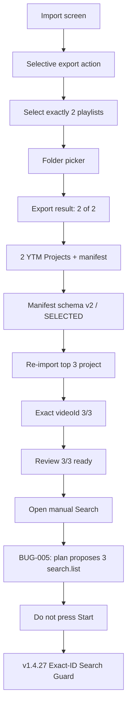

# v1.4.26 — Phone QA Flow

```mermaid
flowchart TD
    A[Import screen] --> B[Selective export action]
    B --> C[Select exactly 2 playlists]
    C --> D[Folder picker]
    D --> E[Export result: 2 of 2]
    E --> F[2 YTM Projects + manifest]
    F --> G[Manifest schema v2 / SELECTED]
    G --> H[Re-import top 3 project]
    H --> I[Exact videoId 3/3]
    I --> J[Review 3/3 ready]
    J --> K[Open manual Search]
    K --> L[BUG-005: plan proposes 3 search.list]
    L --> M[Do not press Start]
    M --> N[v1.4.27 Exact-ID Search Guard]
```
