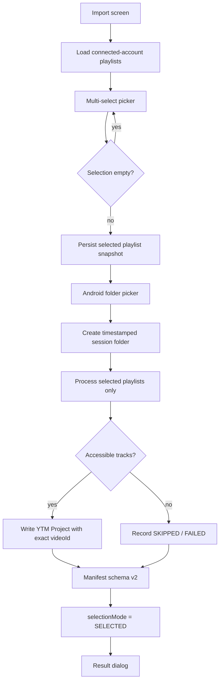

# v1.4.26 — Selective Account Export Flow

```mermaid
flowchart TD
    A[Import screen] --> B[Load connected-account playlists]
    B --> C[Multi-select picker]
    C --> D{Selection empty?}
    D -- yes --> C
    D -- no --> E[Persist selected playlist snapshot]
    E --> F[Android folder picker]
    F --> G[Create timestamped session folder]
    G --> H[Process selected playlists only]
    H --> I{Accessible tracks?}
    I -- yes --> J[Write YTM Project with exact videoId]
    I -- no --> K[Record SKIPPED / FAILED]
    J --> L[Manifest schema v2]
    K --> L
    L --> M[selectionMode = SELECTED]
    M --> N[Result dialog]
```

No remote playlist mutation occurs in this flow.
