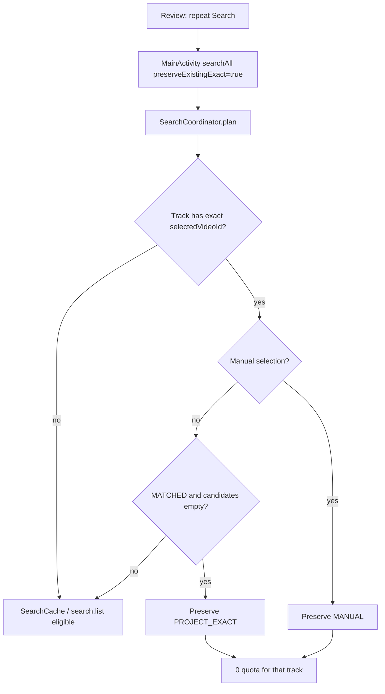

# v1.4.27 — Exact-ID Search Guard

```mermaid
flowchart TD
    A[Review: repeat Search] --> B[MainActivity searchAll preserveExistingExact=true]
    B --> C[SearchCoordinator.plan]
    C --> D{Track has exact selectedVideoId?}
    D -- no --> E[SearchCache / search.list eligible]
    D -- yes --> F{Manual selection?}
    F -- yes --> G[Preserve MANUAL]
    F -- no --> H{MATCHED and candidates empty?}
    H -- yes --> I[Preserve PROJECT_EXACT]
    H -- no --> E
    I --> J[0 quota for that track]
    G --> J
```

The guard preserves canonical exact selections while still allowing candidate-
based searched tracks to participate in an intentional repeat search.
