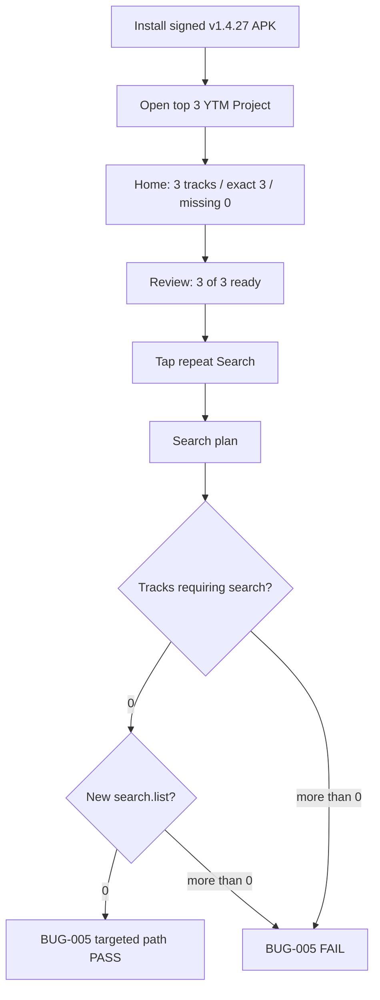

# v1.4.27 — Phone QA Flow — Exact-ID Search Guard

## Invariant

Canonical exact project/account selections must not consume ordinary repeat-search quota.

Candidate-based search results remain a separate state and can still be eligible for intentional repeat search.
