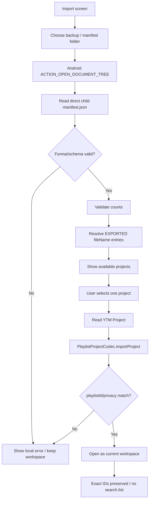

# v1.4.28 — Bulk Manifest Import Flow

## Boundary

The manifest import path is local filesystem work only.

It must not use `YouTubeApi`, `playlistItems.list`, `search.list`, or remote playlist writes.
