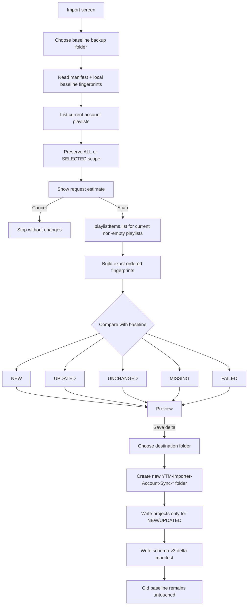

# v1.4.29 — Incremental Backup Flow

## Safety boundary

There is no YouTube/YTM write endpoint in this flow.

`MISSING` means "not present in the current scoped account list"; it never means "delete from YouTube" or "delete from the old backup".
