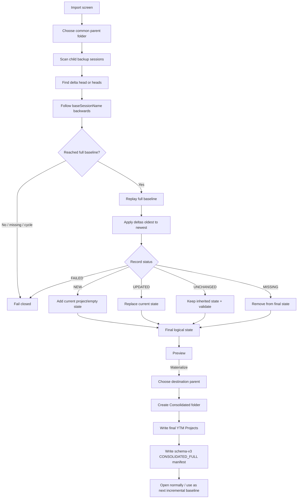

# v1.4.30 — Consolidated Delta-Chain Flow

## Safety

The chain root and every source session are read-only inputs.

Materialization only creates a new destination folder.

No YouTube/YTM API call is part of this flow.
