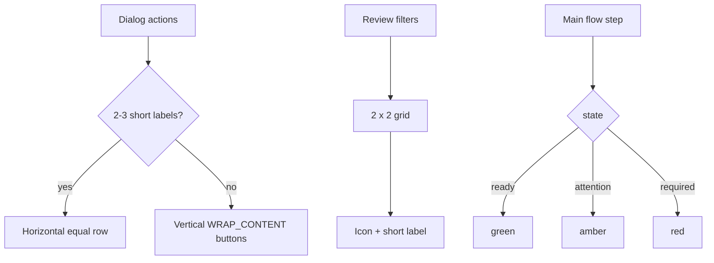

# v1.4.4 — Adaptive buttons

```mermaid
flowchart TD
    A[Dialog actions] --> B{2-3 short labels?}
    B -- yes --> C[Horizontal equal row]
    B -- no --> D[Vertical WRAP_CONTENT buttons]

    E[Review filters] --> F[2 x 2 grid]
    F --> G[Icon + short label]

    H[Main flow step] --> I{state}
    I -->|ready| J[green]
    I -->|attention| K[amber]
    I -->|required| L[red]
```
