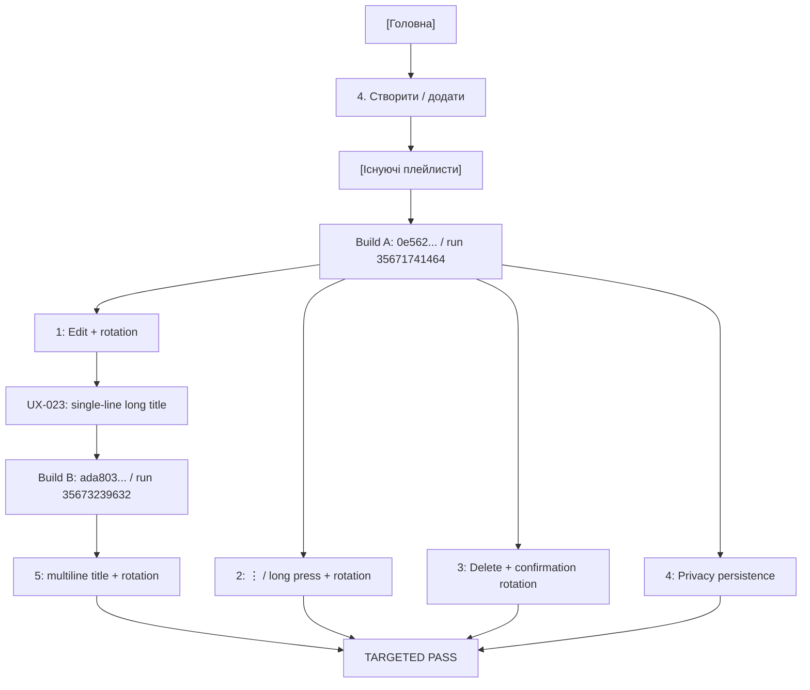

# v1.4.48 Phone QA Flow

```mermaid
flowchart TD
    A["[Головна]"]
    B["4. Створити / додати"]
    C["[Існуючі плейлисти]"]

    B1["Build A: 0e562... / run 35671741464"]
    T1["1: Edit + rotation"]
    T2["2: ⋮ / long press + rotation"]
    T3["3: Delete + confirmation rotation"]
    T4["4: Privacy persistence"]
    FIND["UX-023: single-line long title"]

    B2["Build B: ada803... / run 35673239632"]
    T5["5: multiline title + rotation"]

    PASS["TARGETED PASS"]

    A --> B --> C --> B1
    B1 --> T1 --> FIND
    B1 --> T2
    B1 --> T3
    B1 --> T4
    FIND --> B2 --> T5 --> PASS
    T2 --> PASS
    T3 --> PASS
    T4 --> PASS
```

The diagram deliberately records the two-build evidence lineage.
