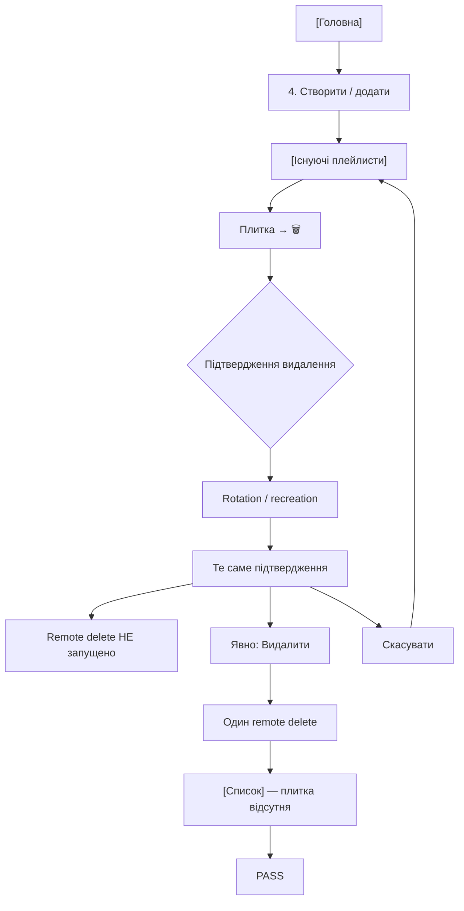

# Playlist Delete Flow

```mermaid
flowchart TD
    A["[Головна]"]
    B["4. Створити / додати"]
    C["[Існуючі плейлисти]"]
    T["Плитка → 🗑"]
    CONFIRM{"Підтвердження видалення"}
    ROT["Rotation / recreation"]
    RESTORE["Те саме підтвердження"]
    NOAUTO["Remote delete НЕ запущено"]
    YES["Явно: Видалити"]
    NO["Скасувати"]
    REMOTE["Один remote delete"]
    LIST["[Список] — плитка відсутня"]
    PASS["PASS"]

    A --> B --> C --> T --> CONFIRM
    CONFIRM --> ROT --> RESTORE --> NOAUTO
    RESTORE --> YES --> REMOTE --> LIST --> PASS
    RESTORE --> NO --> C
```
