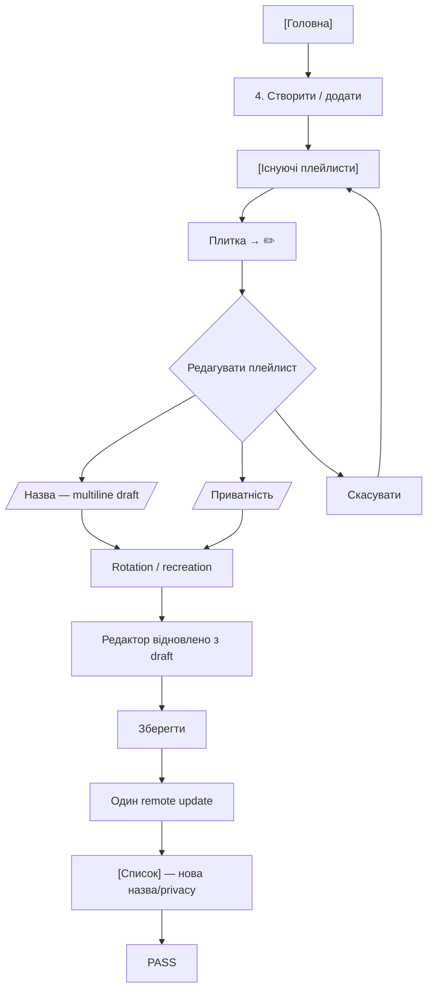

# Playlist Edit Flow

```mermaid
flowchart TD
    A["[Головна]"]
    B["4. Створити / додати"]
    C["[Існуючі плейлисти]"]
    T["Плитка → ✏️"]
    E{"Редагувати плейлист"}
    N[/"Назва — multiline draft"/]
    P[/"Приватність"/]
    R["Rotation / recreation"]
    RESTORE["Редактор відновлено з draft"]
    SAVE["Зберегти"]
    CANCEL["Скасувати"]
    REMOTE["Один remote update"]
    LIST["[Список] — нова назва/privacy"]
    PASS["PASS"]

    A --> B --> C --> T --> E
    E --> N
    E --> P
    N --> R --> RESTORE
    P --> R
    RESTORE --> SAVE --> REMOTE --> LIST --> PASS
    E --> CANCEL --> C
```

Rotation restores editor state but never executes Save.
