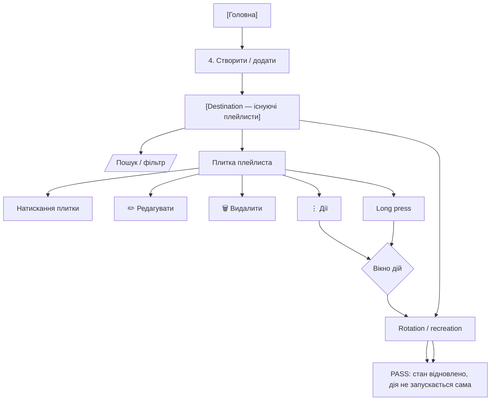

# Playlist Tile Flow

```mermaid
flowchart TD
    A["[Головна]"]
    B["4. Створити / додати"]
    C["[Destination — існуючі плейлисти]"]
    Q[/"Пошук / фільтр"/]
    T["Плитка плейлиста"]
    TAP["Натискання плитки"]
    EDIT["✏️ Редагувати"]
    DELETE["🗑 Видалити"]
    MORE["⋮ Дії"]
    LONG["Long press"]
    MENU{"Вікно дій"}
    ROT["Rotation / recreation"]
    PASS["PASS: стан відновлено, дія не запускається сама"]

    A --> B --> C
    C --> Q
    C --> T
    T --> TAP
    T --> EDIT
    T --> DELETE
    T --> MORE --> MENU
    T --> LONG --> MENU
    C --> ROT --> PASS
    MENU --> ROT --> PASS
```
