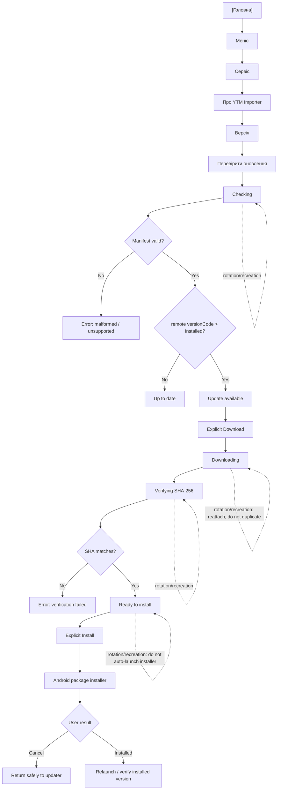

# v1.4.49 — Updater Flow

## Wave status

Wave 1 implements the route through `Up to date` / `Update available` / `Error`.
Wave 2 implements explicit `Download` → `Downloading` → `Verifying SHA-256` → `Ready to install` and passed targeted phone Tests 2/3/4.
Wave 3 implements `Explicit Install` → Android package installer. Permission Settings and installer UI are entered only from an explicit user tap; recreation never auto-enters either system flow.

## Version relation contract

- remote `versionCode` == installed → Up to date;
- remote `versionCode` < installed → installed build is newer; informational
  no-update state, never Error and never downgrade;
- remote `versionCode` > installed → Update available.

## Lifecycle contract

Recreation restores updater state but is never treated as another Check,
Download or Install command.
