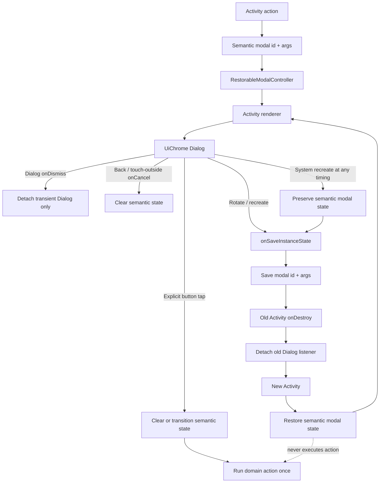

# v1.4.50 — Restorable Modal Lifecycle

Contract:

- `Dialog` is transient rendering, not durable lifecycle state;
- semantic modal id + primitive arguments are the durable state;
- the shared controller owns save/restore/detach bookkeeping;
- Activity-specific renderer owns copy and callbacks;
- recreation restores the same modal over the same parent screen;
- recreation never runs the positive/destructive action;
- `onDismiss` cannot clear durable modal identity;
- explicit button actions clear or transition semantic state;
- Back/touch-outside `onCancel` clears semantic state;
- system teardown timing cannot affect semantic close decisions;
- Cancel/Back/dismiss is a no-op for domain state unless the action already
  completed before recreation.
