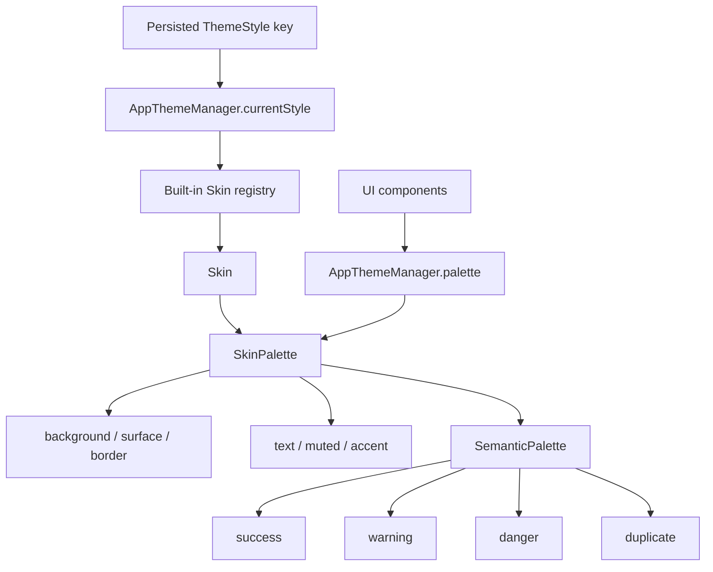

# v1.4.50 — Skin Architecture

```mermaid
flowchart TD
    A[Persisted ThemeStyle key] --> B[AppThemeManager.currentStyle]
    B --> C[Built-in Skin registry]
    C --> D[Skin]
    D --> E[SkinPalette]
    E --> F[background / surface / border]
    E --> G[text / muted / accent]
    E --> H[SemanticPalette]
    H --> I[success]
    H --> J[warning]
    H --> K[danger]
    H --> L[duplicate]

    M[UI components] --> N[AppThemeManager.palette]
    N --> E
```

Wave 1 keeps the existing three style identities and exact RGB values while
making the Skin unit explicit and semantic roles structurally named.
