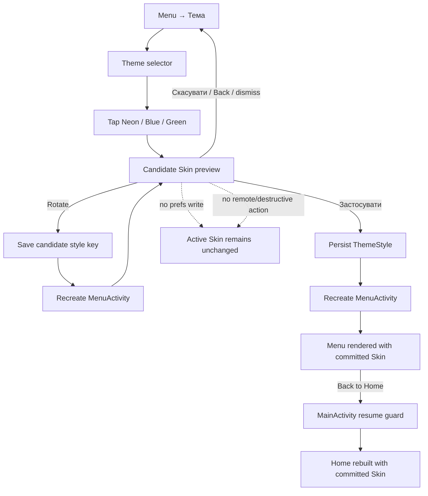

# v1.4.50 — Skin Preview Lifecycle

Contract:

- preview is candidate-only;
- only explicit `Застосувати` changes persisted Skin identity;
- Cancel/Back/dismiss are no-op with respect to Skin persistence;
- Activity recreation restores the same candidate preview;
- applying Skin does not change navigation, remote-operation or destructive-action semantics.
