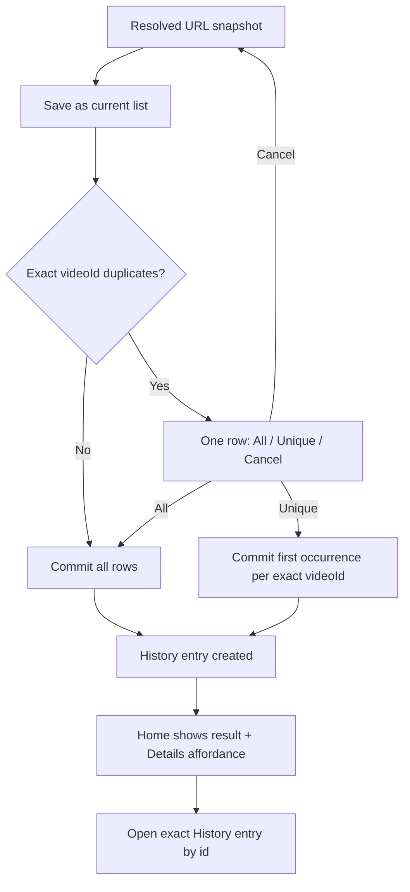

# v1.4.52 — UX Polish Flow

```mermaid
flowchart TD
    A[Resolved URL snapshot] --> B[Save as current list]
    B --> C{Exact videoId duplicates?}
    C -- No --> D[Commit all rows]
    C -- Yes --> E[One row: All / Unique / Cancel]
    E -- All --> D
    E -- Unique --> F[Commit first occurrence per exact videoId]
    E -- Cancel --> A
    D --> G[History entry created]
    F --> G
    G --> H[Home shows result + Details affordance]
    H --> I[Open exact History entry by id]
```
