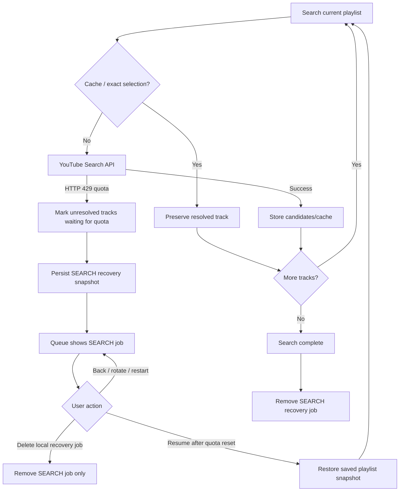

# v1.4.53 — Quota Recovery Flow

```mermaid
flowchart TD
    A[Search current playlist] --> B{Cache / exact selection?}
    B -->|Yes| C[Preserve resolved track]
    B -->|No| D[YouTube Search API]
    D -->|Success| E[Store candidates/cache]
    D -->|HTTP 429 quota| F[Mark unresolved tracks waiting for quota]
    F --> G[Persist SEARCH recovery snapshot]
    G --> H[Queue shows SEARCH job]
    H --> I{User action}
    I -->|Back / rotate / restart| H
    I -->|Delete local recovery job| J[Remove SEARCH job only]
    I -->|Resume after quota reset| K[Restore saved playlist snapshot]
    K --> A
    C --> L{More tracks?}
    E --> L
    L -->|Yes| A
    L -->|No| M[Search complete]
    M --> N[Remove SEARCH recovery job]
```

Invariant: only an explicit Resume action restarts Search. Queue/recreation must
never auto-run Search or YouTube/YTM write operations.
