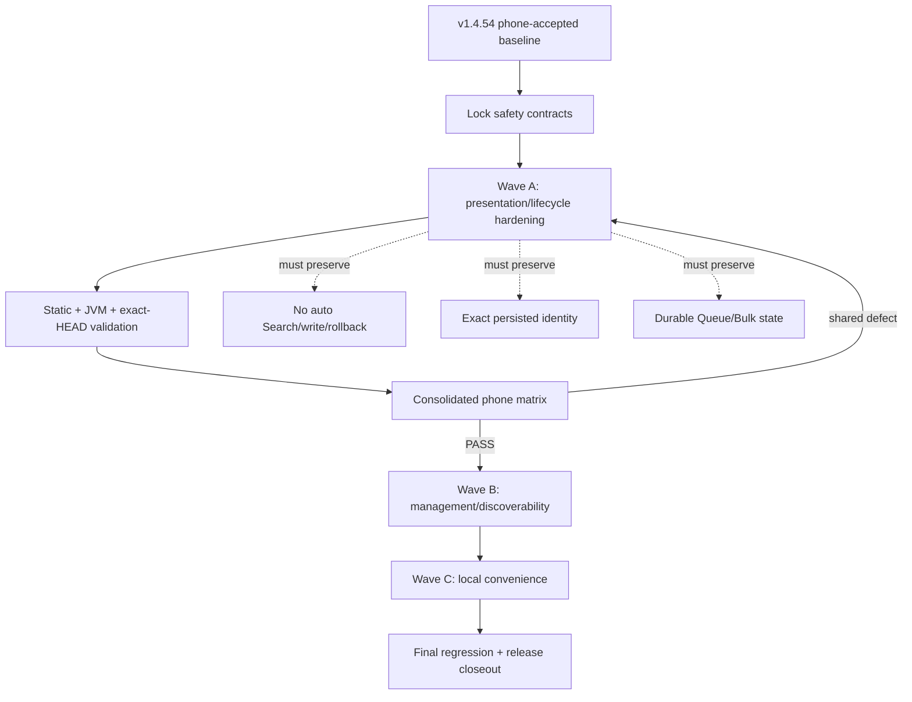

# v1.4.55 — UX Hardening Flow

```mermaid
flowchart TD
    B[v1.4.54 phone-accepted baseline] --> C[Lock safety contracts]
    C --> A[Wave A: presentation/lifecycle hardening]
    A --> S[Static + JVM + exact-HEAD validation]
    S --> P[Consolidated phone matrix]
    P -->|PASS| M[Wave B: management/discoverability]
    P -->|shared defect| A
    M --> L[Wave C: local convenience]
    L --> F[Final regression + release closeout]

    A -. must preserve .-> I[No auto Search/write/rollback]
    A -. must preserve .-> ID[Exact persisted identity]
    A -. must preserve .-> D[Durable Queue/Bulk state]
```

The diagram is sequencing only. It does not change execution semantics.
