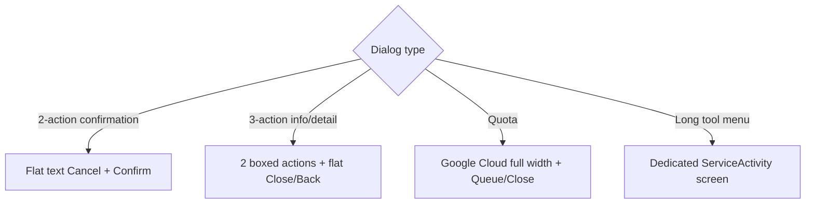

# v1.4.6 — Action hierarchy

```mermaid
flowchart TD
    D{Dialog type}
    D -->|2-action confirmation| C[Flat text Cancel + Confirm]
    D -->|3-action info/detail| T[2 boxed actions + flat Close/Back]
    D -->|Quota| Q[Google Cloud full width + Queue/Close]
    D -->|Long tool menu| S[Dedicated ServiceActivity screen]
```
