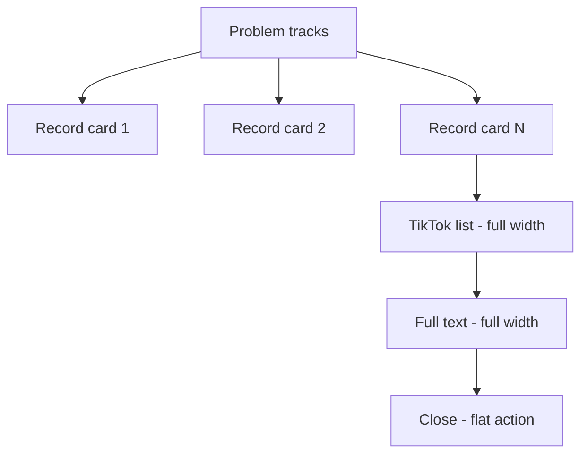

# v1.4.7 — Problem tracks dialog

```mermaid
flowchart TD
    L[Problem tracks] --> R1[Record card 1]
    L --> R2[Record card 2]
    L --> RN[Record card N]
    RN --> T[TikTok list - full width]
    T --> F[Full text - full width]
    F --> C[Close - flat action]
```
