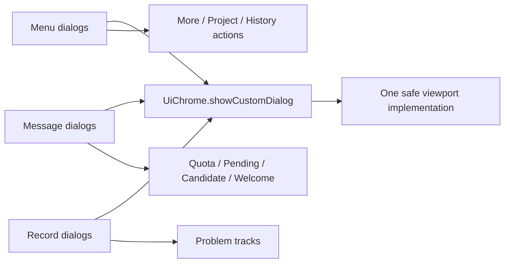

# v1.4.8 — Shared-dialog coverage

```mermaid
flowchart LR
    U[UiChrome.showCustomDialog]

    M[Menu dialogs] --> U
    X[Message dialogs] --> U
    R[Record dialogs] --> U

    M --> M1[More / Project / History actions]
    X --> X1[Quota / Pending / Candidate / Welcome]
    R --> R1[Problem tracks]

    U --> S[One safe viewport implementation]
```

The fix is intentionally shared instead of patching Quota and Problem Tracks separately.
