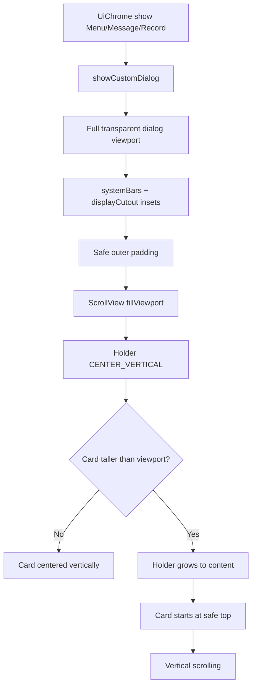

# v1.4.8 — Safe dialog viewport

```mermaid
flowchart TD
    A[UiChrome show Menu/Message/Record]
    --> B[showCustomDialog]
    --> C[Full transparent dialog viewport]

    C --> D[systemBars + displayCutout insets]
    D --> E[Safe outer padding]
    E --> F[ScrollView fillViewport]

    F --> G[Holder CENTER_VERTICAL]
    G --> H{Card taller than viewport?}

    H -- No --> I[Card centered vertically]
    H -- Yes --> J[Holder grows to content]
    J --> K[Card starts at safe top]
    K --> L[Vertical scrolling]
```
