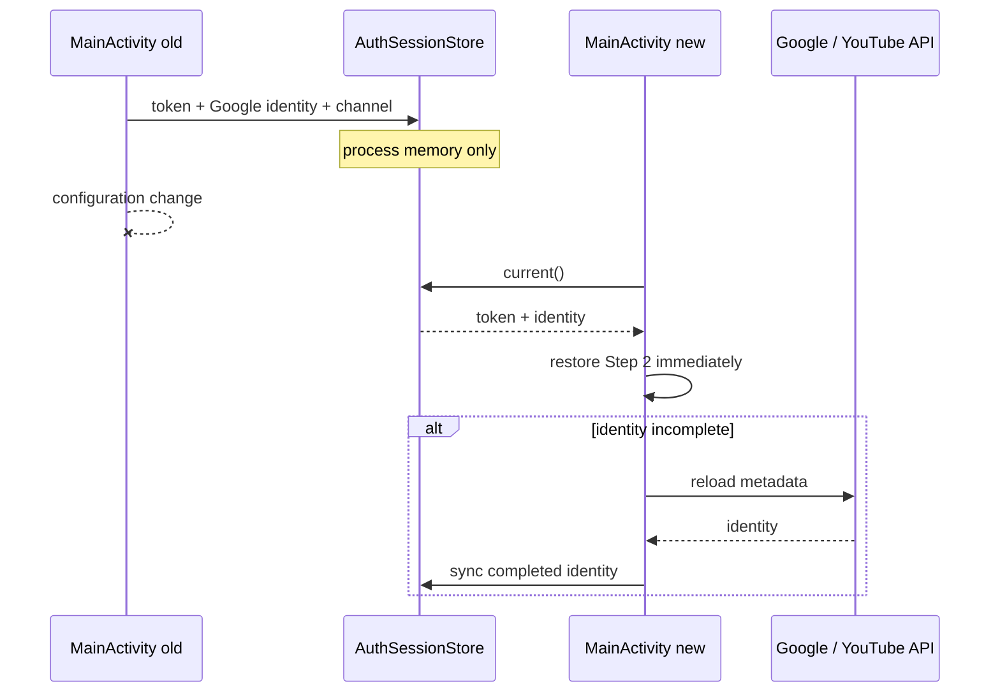

# v1.4.9 — Auth state across rotation

```mermaid
sequenceDiagram
    participant A1 as MainActivity old
    participant S as AuthSessionStore
    participant A2 as MainActivity new
    participant API as Google / YouTube API
    A1->>S: token + Google identity + channel
    Note over S: process memory only
    A1--xA1: configuration change
    A2->>S: current()
    S-->>A2: token + identity
    A2->>A2: restore Step 2 immediately
    alt identity incomplete
        A2->>API: reload metadata
        API-->>A2: identity
        A2->>S: sync completed identity
    end
```
