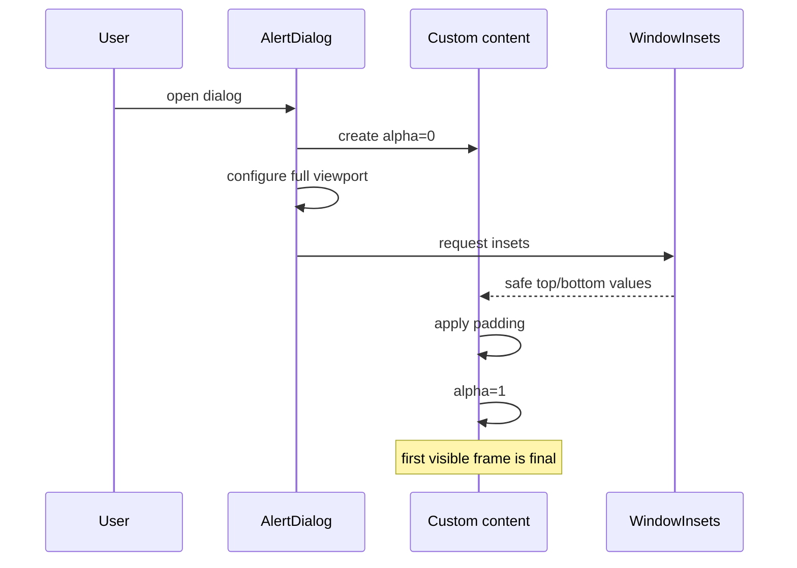

# v1.4.9 — Stable custom-dialog first frame

```mermaid
sequenceDiagram
    participant U as User
    participant D as AlertDialog
    participant C as Custom content
    participant I as WindowInsets
    U->>D: open dialog
    D->>C: create alpha=0
    D->>D: configure full viewport
    D->>I: request insets
    I-->>C: safe top/bottom values
    C->>C: apply padding
    C->>C: alpha=1
    Note over C: first visible frame is final
```
